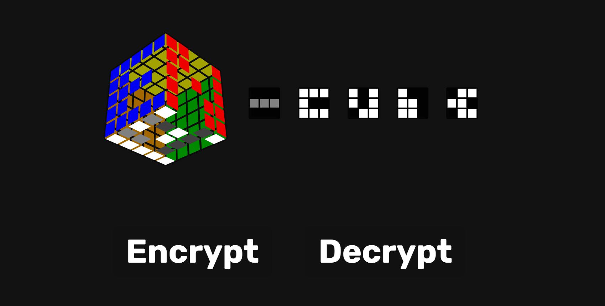

# Bracket Generator

### [Check it out on Firebase](https://en-cube.web.app/)

## About

EN-Cube (encryption cube) has a simple and straightforwards user interface which focuses on the three main components of an encryption scheme

**Generation**

The encryption scheme is symmetric, meaning the encrypting and decrypting are done through the same secret key. This key is freely generated by the user through the use of a 3D interactive Rubik's cube. The moves are recorded and given as the secret key.

**Encryption**
- Plain text is inputted
- Secret key is generated
- Cypher text is produced

**Decryption**
- Encoded text is inputted
- Secret key is entered
- Original text is retrieved

### Built With

The web app was built in [React](https://reactjs.org/), with the encryption cypher written in JavaScript. In order to incorporate a movable and animated Rubik's cube, we used [Chrome Cube Lab](https://www.chrome.com/cubelab) to display the puzzle as well as document the moves.

All images and logos used were generated from [VisualCube](https://cube.rider.biz/visualcube.php)

The web app was deployed using [Firebase](https://firebase.google.com/)

## Prerequisites

- Make sure you have npm
  `npm install npm@latest -g`

## Installation
- Make sure you are in the correct directory `cd en-cube`
- Use `npm i` to install all dependencies
- Host at [http://localhost:3000/](http://localhost:3000/) using `npm start`
